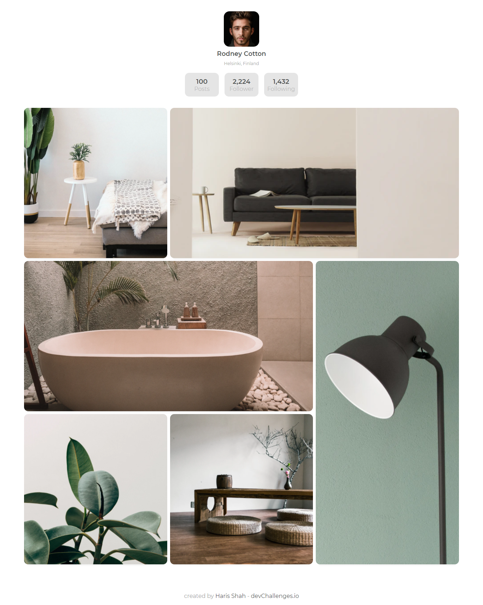

<!-- Please update value in the {}  -->

<h1 align="center">{Your project name}</h1>

   Solution for a challenge from  <a href="http://devchallenges.io" target="_blank">Devchallenges.io</a>.

  <h3>
    <a href="https://devchallenge-gallery.netlify.app/">
      Demo
    </a>
     | 
    <a href="https://github.com/hariscs/my-gallery">
      Solution
    </a>
     | 
    <a href="https://devchallenges.io/challenges/gcbWLxG6wdennelX7b8I">
      Challenge
    </a>
  </h3>

<!-- TABLE OF CONTENTS -->

## Table of Contents

- [Overview](#overview)
- [Features](#features)
- [Contact](#contact)

<!-- OVERVIEW -->

## Overview

## Features

This application/site was created as a submission to a [DevChallenges](https://devchallenges.io/challenges) challenge. The [challenge](https://devchallenges.io/challenges/gcbWLxG6wdennelX7b8I) was to build an application to complete the given user stories.

## Contact

- Website [Haris](https://harisshah.codes/)
- GitHub [@hariscs](https://github.com/hariscs)
- Twitter [@\_haris_shah](https://twitter.com/_haris_shah)
